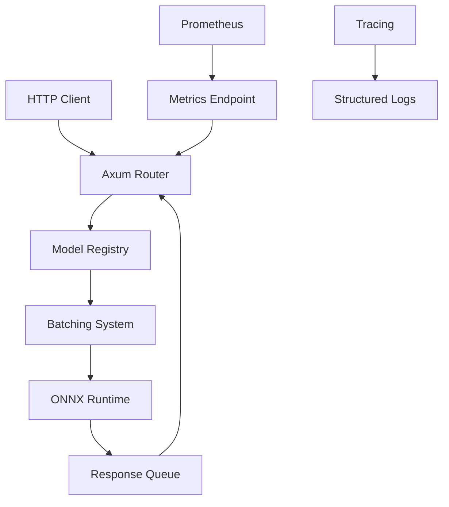

# Cronnx: Production-Grade ML Inference Engine in Rust

**Cronnx** is a high-performance, asynchronous Machine Learning inference server built in Rust. It demonstrates how to take a raw ONNX model and serve it via a robust HTTP API with features like dynamic batching, multi-model support, and production observability.

## Key Features

- **High Performance**: Low-latency inference using `ort` (ONNX Runtime bindings) and `ndarray`.
- **Asynchronous Core**: Built on `tokio` and `axum` to handle thousands of concurrent connections.
- **Dynamic Batching**: Automatically groups incoming requests into batches for efficient GPU/CPU utilization (simulating NVIDIA Triton features).
- **Multi-Model Support**: Hot-swappable model registry supporting V1/V2 deployments and A/B testing.
- **Observability**: Built-in Prometheus metrics (`requests`, `latency`, `batch_size`) and structured tracing.
- **Production Ready**: Dockerized with multi-stage builds and GPU support (CUDA).

## Table of Contents

- [Architecture](#architecture)
- [Quick Start](#quick-start)
- [API Reference](#api-reference)
- [Configuration](#configuration)
- [Testing](#testing)
- [Deployment](#deployment)
- [Development](#development)

## Architecture



### Core Components

1. **Server Layer**: HTTP API using Axum with request/response DTOs
2. **Model Registry**: Thread-safe registry mapping model names to batching queues
3. **Batching System**: Dynamic request batching with configurable timeout and size
4. **Preprocessing**: Image normalization using ImageNet statistics
5. **Observability**: Metrics collection and structured logging

## Quick Start

### Prerequisites

- Rust 1.75+
- `libssl-dev` (or equivalent)

### Running the Server

1. **Download Model**:

    ```bash
    mkdir -p models
    wget https://github.com/onnx/models/raw/main/validated/vision/classification/mobilenet/model/mobilenetv2-7.onnx -O models/mobilenetv2-7.onnx
    ```

2. **Configuration**:
    Create a `config.yaml` file:

    ```yaml
    server:
      port: 3000
      host: "0.0.0.0"
    models:
      - name: "mobilenet"
        path: "models/mobilenetv2-7.onnx"
        batch_size: 16
        batch_timeout_ms: 10
      - name: "mobilenet_backup"
        path: "models/mobilenetv2-7.onnx"
        batch_size: 8
        batch_timeout_ms: 20
    ```

3. **Run**:

    ```bash
    cargo run --release
    ```

4. **Test Inference**:
    ```bash
    # POST a base64 encoded image
    IMAGE=$(base64 -w 0 data/test_image.jpg)
    curl -X POST http://localhost:3000/predict/mobilenet \
         -H "Content-Type: application/json" \
         -d "{\"image\": \"$IMAGE\"}"
    ```

5. **Check Metrics**:
    ```bash
    curl http://localhost:3000/metrics
    ```

## API Reference

### Health Check
```
GET /health
```
Returns "OK" if the server is running.

### Model Prediction
```
POST /predict/{model_name}
```

**Request Body:**
```json
{
  "image": "base64_encoded_image_data"
}
```

**Response:**
```json
{
  "predictions": [
    {
      "class_id": 282,
      "confidence": 0.9876
    }
  ],
  "inference_time_ms": 45.2
}
```

### Metrics Endpoint
```
GET /metrics
```
Returns Prometheus-formatted metrics.

## Configuration

The application is configured via `config.yaml`:

```yaml
server:
  port: 3000          # Server port
  host: "0.0.0.0"     # Server host

models:
  - name: "model_name"        # Unique model identifier
    path: "path/to/model.onnx" # Path to ONNX model file
    batch_size: 16            # Maximum batch size
    batch_timeout_ms: 10      # Batch timeout in milliseconds
```

## Testing

Run the comprehensive test suite:

```bash
# Run all tests
cargo test

# Run specific test modules
cargo test error
cargo test preprocessing  
cargo test batching
cargo test server
```

### Test Coverage

- **Unit Tests**: Individual module validation
- **Integration Tests**: Cross-module interaction verification
- **End-to-End Tests**: Complete system flow validation
- **Error Handling**: All error paths tested
- **Concurrency**: Thread safety and async behavior

## Deployment

### Docker

Build and run with Docker:

```bash
# Build the image
docker build -t cronnx:latest .

# Run with models volume
docker run -p 3000:3000 -v ./models:/app/models cronnx:latest
```

### GPU Support

To enable GPU acceleration, add the CUDA feature to the ORT dependency:

```toml
ort = { version = "2.0.0-rc.10", features = ["ndarray", "cuda"] }
```

### Production Considerations

- Use production-grade ONNX models
- Configure appropriate batch sizes for your hardware
- Set up proper logging and monitoring
- Use reverse proxy (nginx) for production deployments

## Development

### Project Structure

```
cronnx/
├── Cargo.toml          # Dependencies
├── config.yaml         # App Configuration
├── Dockerfile          # Container build
├── docs/               # Documentation
└── src/
    ├── main.rs         # Entry point & setup
    ├── config.rs       # Config structs
    ├── error.rs        # Custom Error handling
    ├── server/         # Axum Handlers & Routes
    ├── model/          # ONNX Loading & Registry
    ├── batching/       # Dynamic Batching Logic
    └── preprocessing/  # Image resizing & normalization
```

### Building

```bash
# Development build
cargo build

# Release build
cargo build --release

# Format code
cargo fmt

# Check for linting issues
cargo clippy
```

## Metrics

The following metrics are collected:

- `requests_received` (counter): Number of requests by model
- `request_latency_seconds` (histogram): Request processing time by model  
- `batch_size` (histogram): Size of processed batches

## License

MIT