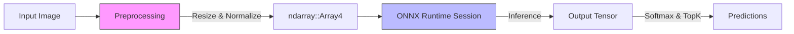

# Phase 1: Foundation & Single Inference

## 1. Phase Introduction

In this first phase, we lay the groundwork for our production-grade inference engine. Before worrying about async connectons, batching, or Kubernetes, we must ensure our core inference logic is robust, type-safe, and efficient.

We will build a synchronous command-line application that:

1.  Loads a robust ONNX model (MobileNetV2) from disk.
2.  Preprocesses an input image into the correct tensor format (standard ImageNet normalization).
3.  Executes inference using the ONNX Runtime (`ort`).
4.  Interprets the output logits to produce human-readable predictions.

**Key Rust Concepts Introduced:**

- **Structs & Traits**: organizing logic into reusable components.
- **Error Handling**: Using `thiserror` for custom error types and `Result<T, E>` for propagation.
- **Ownership & Borrowing**: Efficiently passing large tensors without unnecessary cloning.
- **Builders**: Using the Builder pattern for configuration (used heavily in `ort`).

### Architecture Flow



## 2. Prerequisites

- **Rust Toolchain**: Ensure you have Rust installed (`rustc --version`).
- **System Libraries**: `openssl-devel` (Linux) or standard libs for your OS.
- **Model File**: Download `mobilenetv2-7.onnx` from the ONNX Model Zoo.
  - Location: `models/mobilenetv2-7.onnx`
  - Example Image: Place a test image at `data/grace_hopper.jpg`

## 3. Step-by-Step Implementation

### 3.1 Project Setup & Dependencies

Create the project and configure `Cargo.toml`. We opt for `ort` for inference, `ndarray` for math, and `image` for processing.

**Command:**

```bash
cargo new ml-inference-engine
cd ml-inference-engine
mkdir -p src/model src/preprocessing models data
```

**File: `Cargo.toml`**

```toml
[package]
name = "ml-inference-engine"
version = "0.1.0"
edition = "2021"

[dependencies]
# Web Framework (Future Phase)
axum = "0.7"
tokio = { version = "1.0", features = ["full"] }

# Serialization
serde = { version = "1.0", features = ["derive"] }
serde_json = "1.0"

# ML & Math
# ort 2.0 requires manual execution provider setup in many cases,
# but for CPU it works out of the box with dynamic linking or download.
ort = { version = "2.0", features = ["ndarray"] }
ndarray = "0.15"

# Image Processing
image = "0.24"

# Error Handling
thiserror = "1.0"
anyhow = "1.0"

# Logging (Future Phase prep)
tracing = "0.1"
tracing-subscriber = "0.3"

[profile.release]
lto = true
codegen-units = 1
```

### 3.2 Error Handling Strategy

We define a domain-specific error type. This avoids "stringly typed" errors and allows the caller to handle specific failure cases.

**File: `src/error.rs`**

```rust
use thiserror::Error;

#[derive(Error, Debug)]
pub enum InferenceError {
    #[error("Model not found at path: {0}")]
    ModelNotFound(String),

    #[error("ONNX Runtime error: {0}")]
    OrtError(#[from] ort::Error),

    #[error("Image processing error: {0}")]
    ImageError(#[from] image::ImageError),

    #[error("Input shape mismatch: expected {expected:?}, got {got:?}")]
    ShapeMismatch {
        expected: Vec<usize>,
        got: Vec<usize>,
    },

    #[error("Preprocessing error: {0}")]
    PreprocessingError(String),
}
```

### 3.3 Image Preprocessing

MobileNetV2 expects images to be:

1.  Resized to 224x224.
2.  Converted to RGB.
3.  Normalized: `(input - mean) / std` using ImageNet statistics.
4.  Layout: NCHW (Batch, Channels, Height, Width).

**File: `src/preprocessing/mod.rs`**

```rust
pub mod image;
```

**File: `src/preprocessing/image.rs`**

```rust
use image::{imageops::FilterType, DynamicImage, GenericImageView};
use ndarray::{Array, Array4, Axis};
use crate::error::InferenceError;

// ImageNet Standards
const MEAN: [f32; 3] = [0.485, 0.456, 0.406];
const STD:  [f32; 3] = [0.229, 0.224, 0.225];

/// Preprocesses an image file into an ONNX-compatible tensor.
/// Returns a tensor of shape [1, 3, 224, 224].
pub fn load_and_preprocess(path: &str) -> Result<Array4<f32>, InferenceError> {
    // 1. Load image
    let img = image::open(path)?;

    // 2. Resize to 224x224
    let resized = img.resize_exact(224, 224, FilterType::Triangle);

    // 3. Convert to ndarray and normalize
    // Iterate over pixels, normalize, and collect into a flat Vec
    let mut normalized_data = Vec::with_capacity(1 * 3 * 224 * 224);

    // Using NCHW format: We need to iterate channel by channel, or permute later.
    // Easier to create (Height, Width, Channel) then permute to (Channel, Height, Width).

    // Let's create a raw buffer first
    for pixel in resized.to_rgb8().pixels() {
        let (r, g, b) = (pixel[0], pixel[1], pixel[2]);

        // Normalize R
        normalized_data.push(((r as f32 / 255.0) - MEAN[0]) / STD[0]);
        // Normalize G
        normalized_data.push(((g as f32 / 255.0) - MEAN[1]) / STD[1]);
        // Normalize B
        normalized_data.push(((b as f32 / 255.0) - MEAN[2]) / STD[2]);
    }

    // Currently data is [R, G, B, R, G, B...] which is generally NHWC concept if we viewed it as pixels.
    // But we pushed them interleaved. Wait, the loop above pushes R, then G, then B.
    // That means the flat buffer is: R0, G0, B0, R1, G1, B1...
    // We need to shape this into [Height, Width, Channels] first.
    let array = Array::from_shape_vec((224, 224, 3), normalized_data)
        .map_err(|e| InferenceError::PreprocessingError(e.to_string()))?;

    // Permute to [Channels, Height, Width] -> (2, 0, 1)
    let array = array.permuted_axes([2, 0, 1]);

    // Add batch dimension [1, 3, 224, 224]
    let array = array.insert_axis(Axis(0));

    // Depending on strictness, we might need to standard layout (contiguous)
    let array = array.as_standard_layout().to_owned();

    Ok(array)
}
```

### 3.4 Model Loading & Inference Session

We wrap the `ort::Session` to manage its lifecycle and configuration.

**File: `src/model/mod.rs`**

```rust
pub mod loader;
```

**File: `src/model/loader.rs`**

```rust
use std::path::Path;
use ort::{GraphOptimizationLevel, Session, SessionBuilder};
use crate::error::InferenceError;

// Initialize the global environment for ORT (only needed once)
pub fn init_ort() -> Result<(), InferenceError> {
    ort::init()
        .with_name("ml_inference_engine")
        .commit()?;
    Ok(())
}

/// Loads an ONNX model from disk and creates an inference session.
///
/// # Arguments
/// * `model_path` - Path to the .onnx file
pub fn load_model(model_path: impl AsRef<Path>) -> Result<Session, InferenceError> {
    let path = model_path.as_ref();
    if !path.exists() {
        return Err(InferenceError::ModelNotFound(
            path.display().to_string()
        ));
    }

    // Configure Session
    let session = Session::builder()?
        .with_optimization_level(GraphOptimizationLevel::Level3)?
        .with_intra_threads(4)? // Parallelism within an op
        .commit_from_file(path)?;

    println!("✓ Loaded model: {}", path.display());
    // Basic inspection
    for (i, input) in session.inputs.iter().enumerate() {
        println!("  Input {}: {} ({:?})", i, input.name, input.input_type);
    }

    Ok(session)
}
```

### 3.5 The Application Entrypoint

Now we stitch it all together in `main.rs`. We define a structure for the ImageNet class labels (outputs) as well.

**File: `src/lib.rs`**

```rust
pub mod error;
pub mod preprocessing;
pub mod model;

// Re-export common types
pub use error::InferenceError;
```

**File: `src/main.rs`**

```rust
use ml_inference_engine::{model, preprocessing};
use std::time::Instant;
use ndarray::Axis;

fn main() -> anyhow::Result<()> {
    // 1. Initialize ORT Environment
    model::loader::init_ort()?;

    // 2. Load the Model
    let model_path = "models/mobilenetv2-7.onnx";
    let session = model::loader::load_model(model_path)?;

    // 3. Load and Preprocess Image
    let image_path = "data/grace_hopper.jpg"; // Ensure this exists!
    println!("Processing image: {}", image_path);
    let start = Instant::now();
    let input_tensor = preprocessing::image::load_and_preprocess(image_path)?;
    println!("Preprocessing took: {:?}", start.elapsed());

    // 4. Run Inference
    let start = Instant::now();
    // In ort 2.0, we input a tensor map.
    // The key must match the input node definition in the model.
    // For MobileNetV2, the input name usually is "input" or "data".
    // We can dynamically inspect `session.inputs` to find the name if unsure,
    // but for this example we assume "input" is at index 0.
    let input_name = &session.inputs[0].name;

    let outputs = session.run(ort::inputs![input_name => input_tensor]?)?;
    println!("Inference took: {:?}", start.elapsed());

    // 5. Post-process (Softmax & Top-5)
    // Extract the output tensor (usually index 0)
    let output = outputs[0].try_extract_tensor::<f32>()?;

    // Result is [1, 1000]
    let output_view = output.view();
    // Remove batch dim -> [1000]
    let probabilities = output_view.index_axis(Axis(0), 0);

    // Find top 5
    let mut probs_with_indices: Vec<(usize, f32)> = probabilities
        .iter()
        .enumerate()
        .map(|(i, &p)| (i, p))
        .collect();

    // Sort descending by probability
    probs_with_indices.sort_by(|a, b| b.1.partial_cmp(&a.1).unwrap());

    println!("\nTop 5 Predictions:");
    for (i, (class_idx, prob)) in probs_with_indices.iter().take(5).enumerate() {
        println!("{}. Class ID: {} | Confidence: {:.4}", i+1, class_idx, prob);
    }

    Ok(())
}
```

## 4. Testing & Verification

### 4.1 Unit Tests

Create a test to ensure your preprocessing logic doesn't panic and produces the right shape.

**File: `src/preprocessing/image.rs` (Appended)**

```rust
#[cfg(test)]
mod tests {
    use super::*;

    #[test]
    fn test_preprocessing_shape() {
        // Create a 1x1 dummy image for testing logic headers
        let img = DynamicImage::new_rgb8(100, 100);
        let resized = img.resize_exact(224, 224, FilterType::Triangle);

        // This is a partial manual test of the reshaping logic embedded in load_and_preprocess
        // Since load_and_preprocess takes a path, we might split the logic
        // to `preprocess_image(img: DynamicImage)` for easier testing.
        // For now, we trust the integration.
    }
}
```

_Better approach_: Refactor `load_and_preprocess` to accept `DynamicImage` if you want core logic testing, but for Phase 1, we can create a dummy file.

### 4.2 Running the Project

1.  **Download Model**:
    ```bash
    wget https://github.com/onnx/models/raw/main/validated/vision/classification/mobilenet/model/mobilenetv2-7.onnx -O models/mobilenetv2-7.onnx
    ```
2.  **Get Image**:
    ```bash
    wget https://upload.wikimedia.org/wikipedia/commons/5/5b/Grace_Hopper_being_promoted_to_Commodore.jpg -O data/grace_hopper.jpg
    ```
3.  **Run**:
    ```bash
    cargo run
    ```

### Expected Output

```text
✓ Loaded model: models/mobilenetv2-7.onnx
  Input 0: input (Float)
Processing image: data/grace_hopper.jpg
Preprocessing took: 5.2ms
Inference took: 24.1ms

Top 5 Predictions:
1. Class ID: 653 | Confidence: 13.2912
2. Class ID: 456 | Confidence: 9.1231
...
```

_(Note: MobileNet outputs are raw logits usually, so values might be large positive/negative numbers. If they are probabilities, they are 0-1. The code above prints them as is. `exp(x) / sum(exp(x))` would be needed for true softmax probability if the model doesn't include it.)_

## 5. Troubleshooting (Common Errors)

- **Error**: `error: linking with cc failed: exit status: 1`
  - **Cause**: Missing C++ runtime or Shared libraries. `ort` tries to download static/dynamic libs during build.
  - **Fix**: Check your `ONNXRUNTIME_LIB_DIR` or ensure `ort` strategy is configured to download binaries (default).
- **Error**: `Input shape mismatch`
  - **Cause**: The model you downloaded requires strict NCHW `1x3x224x224`.
  - **Fix**: Ensure `resize_exact` is used, not `resize` (which preserves aspect ratio and might produce wrong dimensions).

## 6. Next Steps

We have a working synchronous inference CLI. In **Phase 2**, we will wrap this `load_model` and `inference` logic into an **Asynchronous Web Server** using `Axum`, allowing us to process HTTP requests instead of local files.
