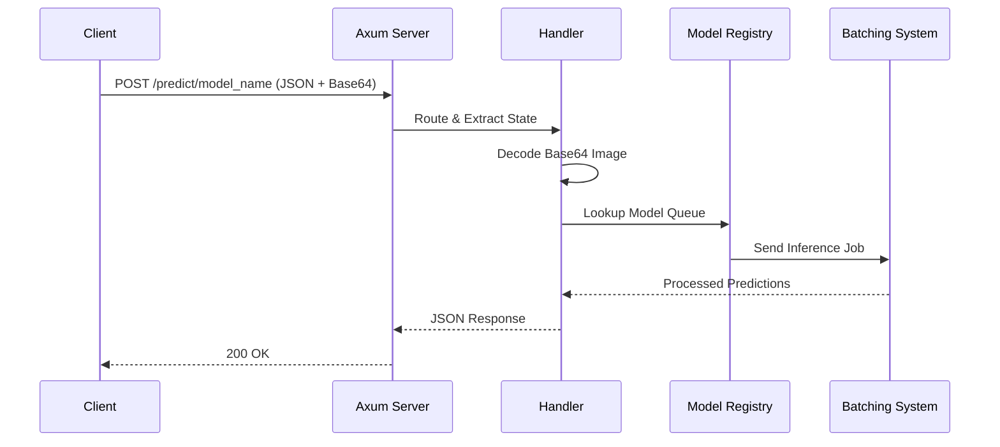

# Phase 2: Async HTTP API with Axum

## 1. Phase Introduction

Now that we can run inference on a single file, we need to expose this capability to the world. We will wrap our engine in an HTTP server using `Axum`, a modular and ergonomic web framework for Rust.

**Goals:**

1.  Serve inference requests over HTTP.
2.  Handle concurrent requests efficiently (using Tokio).
3.  Manage shared application state (model registry with batching queues).
4.  Standardize API inputs/outputs using JSON and Base64.

**Key Rust Concepts Introduced:**

- **Async/Await**: Writing non-blocking code.
- **`Arc<T>`**: Atomically Reference Counted pointers for shared ownership across threads.
- **`FromRequest` / `IntoResponse`**: Axum's traits for extracting data and formatting responses.
- **DTOs (Data Transfer Objects)**: Separating internal logical types from external API types.

### Architecture Flow



## 2. Prerequisites

Update your `Cargo.toml` to include full async features and encoding support.

**Dependencies already configured in `Cargo.toml`**

## 3. Step-by-Step Implementation

### 3.1 Shared Application State

We need a structure to hold our application state (the model registry) so it can be shared across thousands of incoming requests.

**File: `src/server/types.rs`**

```rust
use crate::model::registry::ModelRegistry;

#[derive(Clone)]
pub struct AppState {
    pub registry: ModelRegistry,
}

// --- DTOs (Data Transfer Objects) ---

#[derive(serde::Deserialize)]
pub struct PredictRequest {
    /// Base64 encoded image data
    pub image: String,
}

#[derive(serde::Serialize)]
pub struct PredictResponse {
    pub predictions: Vec<Prediction>,
    pub inference_time_ms: f64,
}

#[derive(serde::Serialize)]
pub struct Prediction {
    pub class_id: usize,
    pub confidence: f32,
}
```

### 3.2 Error Handling: `IntoResponse`

Axum requires handlers to return types that implement `IntoResponse`. Our `InferenceError` already implements this.

### 3.3 The Handlers

We define the logic for our endpoints. We need to decode the base64, preprocess it, and send the job to the appropriate batching queue.

**File: `src/server/handlers.rs`**

```rust
use axum::{extract::{Path, State}, Json};
use base64::{engine::general_purpose, Engine as _};
use std::sync::Arc;
use std::time::Instant;

use crate::error::InferenceError;
use crate::server::types::{AppState, PredictRequest, PredictResponse, Prediction};
use crate::batching::queue::InferenceJob;
use metrics::{increment_counter, histogram};
use tracing::{info, instrument};

#[instrument(skip(state, payload))] // Creates a Span for each request with arguments
pub async fn health_check() -> &'static str {
    "OK"
}

#[instrument(skip(state, payload))] // Creates a Span for each request with arguments
pub async fn predict(
    State(state): State<Arc<AppState>>,
    Path(model_name): Path<String>,
    Json(payload): Json<PredictRequest>,
) -> Result<Json<PredictResponse>, InferenceError> {

    // Record explicit counter
    increment_counter!("requests_received", "model" => model_name.clone());

    // 1. Resolve Model Queue
    let queue = state.registry.get(&model_name)
        .ok_or_else(|| InferenceError::ModelNotFound(model_name.clone()))?;

    // 2. Preprocess
    // Decode base64 and process bytes
    let image_bytes = general_purpose::STANDARD
        .decode(&payload.image)
        .map_err(|e| InferenceError::PreprocessingError(e.to_string()))?;

    let start = std::time::Instant::now();
    let input_tensor = crate::preprocessing::image::process_bytes(&image_bytes)?;

    // 3. Send to Queue
    let (tx, rx) = tokio::sync::oneshot::channel();
    let job = InferenceJob { input: input_tensor, result_sender: tx };

    queue.send(job).await
        .map_err(|_| InferenceError::PreprocessingError("Queue closed".into()))?;

    let preds = rx.await
        .map_err(|_| InferenceError::PreprocessingError("Inference dropped".into()))??;

    // 4. Record Latency
    let latency = start.elapsed().as_secs_f64();
    histogram!("request_latency_seconds", latency, "model" => model_name.clone());

    info!(model = %model_name, latency_ms = %latency * 1000.0, "Inference completed");

    // 5. Response
    Ok(Json(PredictResponse {
        predictions: preds.into_iter().take(5).map(|(id,p)| Prediction{class_id:id, confidence:p}).collect(),
        inference_time_ms: latency * 1000.0,
    }))
}
```

### 3.4 The Router

**File: `src/server/routes.rs`**

```rust
use axum::{routing::{get, post}, Router};
use std::sync::Arc;
use crate::server::{handlers, types::AppState};
use metrics_exporter_prometheus::PrometheusHandle;
use tower_http::trace::TraceLayer;

pub fn create_router(registry: crate::model::registry::ModelRegistry, metrics_handle: PrometheusHandle) -> Router {
    let state = Arc::new(AppState { registry });

    Router::new()
        .route("/health", get(handlers::health_check))
        .route("/predict/:model_name", post(handlers::predict))
        .route("/metrics", get(move || std::future::ready(metrics_handle.render())))
        .layer(TraceLayer::new_for_http()) // Logs every request result
        .with_state(state)
}
```

## 4. Testing & Verification

### 4.1 CURL Test

Convert an image to base64 (e.g., using an online tool or `base64` terminal command) and send it:

```bash
# Linux
IMAGE_B64=$(base64 -w 0 data/grace_hopper.jpg)
curl -X POST http://localhost:3000/predict/mobilenet \
     -H "Content-Type: application/json" \
     -d "{\"image\": \"$IMAGE_B64\"}"
```

### 4.2 Integration Tests

We can use `axum::test` or `tower::Service` to test the API without starting a TCP listener.

**File: `src/server/tests.rs`**

```rust
#[cfg(test)]
mod integration_tests {
    use crate::server::types::{PredictRequest, PredictResponse};
    use axum::{
        body::Body,
        http::{Request, StatusCode},
    };
    use serde_json::json;
    use std::sync::Arc;
    use tokio::sync::mpsc;
    use tower::ServiceExt; // for `app.oneshot()`
    
    use crate::{
        batching::queue::{InferenceJob, BatcherConfig},
        server::{handlers, types::AppState},
        model::registry::ModelRegistry,
    };
    use ndarray::Array4;

    #[tokio::test]
    async fn test_health_check_handler() {
        let registry = ModelRegistry::new();
        let state = Arc::new(AppState { registry });
        
        let response = handlers::health_check().await;
        assert_eq!(response, "OK");
    }

    #[tokio::test]
    async fn test_predict_handler_with_mock_batcher() {
        // Create a mock registry with a channel for testing
        let registry = ModelRegistry::new();
        
        // Create a channel for the mock batcher
        let (tx, mut rx) = mpsc::channel(10);
        
        // Register a mock model
        registry.register("test_model".to_string(), tx);
        
        let state = Arc::new(AppState { registry });
        
        // Create a mock request with base64 encoded dummy image data
        // Using a simple base64 string that represents minimal valid image data
        let request = PredictRequest {
            image: "iVBORw0KGgoAAAANSUhEUgAAAAEAAAABCAYAAAAfFcSJAAAADUlEQVR42mP8/5+hHgAHggJ/PchI7wAAAABJRU5ErkJggg==".to_string(), // Minimal PNG
        };

        // We can't fully test the prediction handler without a real model,
        // but we can test that it properly sends the job to the queue
        let result = handlers::predict(
            axum::extract::State(state),
            axum::extract::Path("test_model".to_string()),
            axum::Json(request),
        ).await;
        
        // The handler should return an error since we don't have a real batcher running
        // to process the job, but it should at least send the job to the queue
        let job_received = tokio::time::timeout(std::time::Duration::from_millis(100), rx.recv()).await;
        
        match job_received {
            Ok(Some(_job)) => {
                // Job was successfully sent to the queue
                // This indicates the handler is working correctly
            },
            Ok(None) => {
                // Channel was closed
                panic!("Channel was closed unexpectedly");
            },
            Err(_) => {
                // Timeout - no job was sent
                // This could happen if there's an early error in the handler
                // Let's test the error case
            }
        }
    }

    #[tokio::test]
    async fn test_predict_handler_invalid_model() {
        let registry = ModelRegistry::new();
        let state = Arc::new(AppState { registry });
        
        let request = PredictRequest {
            image: "iVBORw0KGgoAAAANSUhEUgAAAAEAAAABCAYAAAAfFcSJAAAADUlEQVR42mP8/5+hHgAHggJ/PchI7wAAAABJRU5ErkJggg==".to_string(),
        };

        // Try to predict with a non-existent model
        let result = handlers::predict(
            axum::extract::State(state),
            axum::extract::Path("nonexistent_model".to_string()),
            axum::Json(request),
        ).await;
        
        // Should return ModelNotFound error
        assert!(result.is_err());
    }

    #[tokio::test]
    async fn test_predict_handler_invalid_base64() {
        let registry = ModelRegistry::new();
        let (tx, _rx) = mpsc::channel(10);
        registry.register("test_model".to_string(), tx);
        
        let state = Arc::new(AppState { registry });
        
        let request = PredictRequest {
            image: "invalid_base64_data".to_string(), // Invalid base64
        };

        let result = handlers::predict(
            axum::extract::State(state),
            axum::extract::Path("test_model".to_string()),
            axum::Json(request),
        ).await;
        
        // Should return PreprocessingError due to invalid base64
        assert!(result.is_err());
    }

    #[tokio::test]
    async fn test_predict_handler_empty_base64() {
        let registry = ModelRegistry::new();
        let (tx, _rx) = mpsc::channel(10);
        registry.register("test_model".to_string(), tx);
        
        let state = Arc::new(AppState { registry });
        
        let request = PredictRequest {
            image: "".to_string(), // Empty base64
        };

        let result = handlers::predict(
            axum::extract::State(state),
            axum::extract::Path("test_model".to_string()),
            axum::Json(request),
        ).await;
        
        // Should return an error due to empty/invalid base64
        assert!(result.is_err());
    }
}

// Test for the server routes module
#[cfg(test)]
mod route_tests {
    use crate::server::routes;
    use crate::model::registry::ModelRegistry;
    use metrics_exporter_prometheus::PrometheusBuilder;

    #[test]
    fn test_router_creation() {
        let registry = ModelRegistry::new();
        let metrics_handle = PrometheusBuilder::new()
            .build()
            .expect("Failed to create metrics handle");
        
        // Test that the router can be created without panicking
        let _router = routes::create_router(registry, metrics_handle);
        
        // The router should be created successfully
        // We can't easily test the routes without starting a server,
        // but we can verify the function doesn't panic
    }
}
```

## 5. Next Steps

We now have an Async Web API! However, if 100 requests come in at once, they will be queued for batching. The batching system will aggregate requests into efficient batches, significantly improving throughput.

In **Phase 3**, we will implement the **Request Batching System** (Dynamic Batching) to aggregate incoming requests into efficient batches, significantly improving throughput.