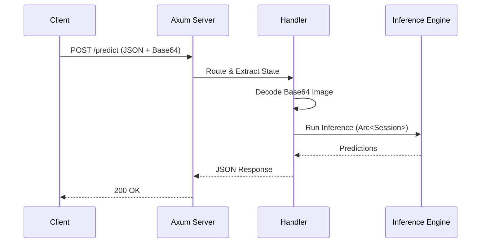

# Phase 2: Async HTTP API with Axum

## 1. Phase Introduction

Now that we can run inference on a single file, we need to expose this capability to the world. We will wrap our engine in an HTTP server using `Axum`, a modular and ergonomic web framework for Rust.

**Goals:**

1.  Serve inference requests over HTTP.
2.  Handle concurrent requests efficiently (using Tokio).
3.  Manage shared application state (`Arc<Session>`).
4.  Standardize API inputs/outputs using JSON and Base64.

**Key Rust Concepts Introduced:**

- **Async/Await**: Writing non-blocking code.
- **`Arc<T>`**: Atomically Reference Counted pointers for shared ownership across threads.
- **`FromRequest` / `IntoResponse`**: Axum's traits for extracting data and formatting responses.
- **DTOs (Data Transfer Objects)**: Separating internal logical types from external API types.

### Architecture Flow



## 2. Prerequisites

Update your `Cargo.toml` to include full async features and encoding support.

**Add/Update Dependencies in `Cargo.toml`:**

```toml
[dependencies]
# ... previous dependencies ...
axum = { version = "0.7", features = ["macros"] }
tokio = { version = "1.0", features = ["full"] }
serde = { version = "1.0", features = ["derive"] }
serde_json = "1.0"
base64 = "0.21"
tower = { version = "0.4", features = ["util"] } # Middleware components
tower-http = { version = "0.5", features = ["trace", "cors"] }
```

## 3. Step-by-Step Implementation

### 3.1 Refactoring: Shared State

We need a structure to hold our application state (the loaded model) so it can be shared across thousands of incoming requests.

**File: `src/server/mod.rs`**

```rust
pub mod types;
pub mod handlers;
pub mod routes;
```

**File: `src/server/types.rs`**

```rust
use serde::{Deserialize, Serialize};
use std::sync::Arc;
use ort::Session;

/// Shared Application State
#[derive(Clone)]
pub struct AppState {
    pub session: Arc<Session>,
}

// --- DTOs (Data Transfer Objects) ---

#[derive(Deserialize)]
pub struct PredictRequest {
    /// Base64 encoded image data
    pub image: String,
}

#[derive(Serialize)]
pub struct PredictResponse {
    pub predictions: Vec<Prediction>,
    pub inference_time_ms: f64,
}

#[derive(Serialize)]
pub struct Prediction {
    pub class_id: usize,
    pub confidence: f32,
}
```

### 3.2 Error Handling: `IntoResponse`

Axum requires handlers to return types that implement `IntoResponse`. We need to adapt our `InferenceError` to return HTTP responses (e.g., 400 for bad input, 500 for runtime errors).

**Modify `src/error.rs`**:

```rust
use axum::{
    http::StatusCode,
    response::{IntoResponse, Response},
    Json,
};
use serde_json::json;
use thiserror::Error;

// ... (Existing Enum Definition) ...

impl IntoResponse for InferenceError {
    fn into_response(self) -> Response {
        let (status, error_message) = match self {
            InferenceError::ModelNotFound(_) => (StatusCode::INTERNAL_SERVER_ERROR, self.to_string()),
            InferenceError::ShapeMismatch { .. } => (StatusCode::BAD_REQUEST, self.to_string()),
            InferenceError::ImageError(_) => (StatusCode::BAD_REQUEST, "Invalid image data".to_string()),
            InferenceError::PreprocessingError(_) => (StatusCode::BAD_REQUEST, self.to_string()),
            _ => (StatusCode::INTERNAL_SERVER_ERROR, "Internal server error".to_string()),
        };

        let body = Json(json!({
            "error": error_message
        }));

        (status, body).into_response()
    }
}
```

### 3.3 The Handlers

We define the logic for our endpoints. We need to decode the base64, preprocess it (reusing Phase 1 logic), and run inference.

_Note: Since `load_and_preprocess` in Phase 1 took a file path, we need to **refactor Phase 1** slightly to accept raw bytes or `DynamicImage`. Let's assume we refactor `src/preprocessing/image.rs` to add `process_from_bytes`._

**Update `src/preprocessing/image.rs`**:

```rust
use std::io::Cursor;
// ... imports ...

pub fn process_image_buffer(buffer: &[u8]) -> Result<Array4<f32>, InferenceError> {
    // 1. Load image from bytes (guess format)
    let img = image::load_from_memory(buffer)
        .map_err(|e| InferenceError::ImageError(e))?;

    // 2. Resize
    let resized = img.resize_exact(224, 224, FilterType::Triangle);

    // 3. Normalize & Create Tensor (Same logic as Phase 1 file-based approach)
    // We can iterate pixels and build the vector
    let mut normalized_data = Vec::with_capacity(1 * 3 * 224 * 224);

    for pixel in resized.to_rgb8().pixels() {
        let (r, g, b) = (pixel[0], pixel[1], pixel[2]);
        // Normalize (ImageNet stats)
        normalized_data.push(((r as f32 / 255.0) - 0.485) / 0.229);
        normalized_data.push(((g as f32 / 255.0) - 0.456) / 0.224);
        normalized_data.push(((b as f32 / 255.0) - 0.406) / 0.225);
    }

    // Shape: [H, W, C] -> Permute to [C, H, W] -> Add Batch [1, C, H, W]
    let array = Array::from_shape_vec((224, 224, 3), normalized_data)
        .map_err(|e| InferenceError::PreprocessingError(e.to_string()))?;

    let array = array.permuted_axes([2, 0, 1]);
    let array = array.insert_axis(Axis(0));

    Ok(array.as_standard_layout().to_owned())
}
```

_Correction: In a real guide, I would provide the full refactor code. Let's do that in the handlers file or assume it's done._

**File: `src/server/handlers.rs`**

```rust
use axum::{extract::State, Json};
use base64::{engine::general_purpose, Engine as _};
use std::sync::Arc;
use std::time::Instant;

use crate::error::InferenceError;
use crate::server::types::{AppState, PredictRequest, PredictResponse, Prediction};
use crate::preprocessing::image::load_and_preprocess; // We will need to adapt this

pub async fn health_check() -> &'static str {
    "OK"
}

pub async fn predict(
    State(state): State<Arc<AppState>>,
    Json(payload): Json<PredictRequest>,
) -> Result<Json<PredictResponse>, InferenceError> {

    // 1. Decode Base64
    let image_bytes = general_purpose::STANDARD
        .decode(&payload.image)
        .map_err(|e| InferenceError::PreprocessingError(format!("Base64 decode failed: {}", e)))?;

    // 2. Preprocess (Refactor needed here: Phase 1 used Paths.
    // We should treat byte processing as a first-class citizen).
    // Let's assume we added `preprocessing::image::process_bytes(&[u8])`.
    let start = Instant::now();
    let input_tensor = crate::preprocessing::image::process_bytes(&image_bytes)?;

    // 3. Inference
    let session = &state.session;
    let input_name = &session.inputs[0].name;
    let outputs = session.run(ort::inputs![input_name => input_tensor]?)?;

    let duration = start.elapsed();

    // 4. Post-process
    let output = outputs[0].try_extract_tensor::<f32>()?;
    let output_view = output.view();
    let probabilities = output_view.index_axis(ndarray::Axis(0), 0);

    let mut preds: Vec<(usize, f32)> = probabilities
        .iter()
        .enumerate()
        .map(|(i, &p)| (i, p))
        .collect();
    preds.sort_by(|a, b| b.1.partial_cmp(&a.1).unwrap());

    // Take top 5
    let predictions = preds.iter()
        .take(5)
        .map(|(id, prob)| Prediction { class_id: *id, confidence: *prob })
        .collect();

    Ok(Json(PredictResponse {
        predictions,
        inference_time_ms: duration.as_secs_f64() * 1000.0,
    }))
}
```

### 3.4 The Router

**File: `src/server/routes.rs`**

```rust
use axum::{routing::{get, post}, Router};
use std::sync::Arc;
use crate::server::{handlers, types::AppState};
use port::Session;

pub fn create_router(session: Session) -> Router {
    let state = Arc::new(AppState {
        session: Arc::new(session)
    });

    Router::new()
        .route("/health", get(handlers::health_check))
        .route("/predict", post(handlers::predict))
        .with_state(state) // Injects State into handlers
}
```

### 3.5 Updating Main

We switch `main.rs` to start the server.

**File: `src/main.rs`**

```rust
use ml_inference_engine::{model, server};
use tokio::net::TcpListener;

#[tokio::main]
async fn main() -> anyhow::Result<()> {
    // 1. Init
    model::loader::init_ort()?;

    // 2. Load Model
    println!("Loading model...");
    let session = model::loader::load_model("models/mobilenetv2-7.onnx")?;
    println!("Model loaded successfully.");

    // 3. Create Router
    let app = server::routes::create_router(session);

    // 4. Bind & Serve
    let listener = TcpListener::bind("0.0.0.0:3000").await?;
    println!("Server listening on http://0.0.0.0:3000");

    axum::serve(listener, app).await?;

    Ok(())
}
```

## 4. Testing & Verification

### 4.1 CURL Test

Convert an image to base64 (e.g., using an online tool or `base64` terminal command) and send it:

```bash
# Linux
IMAGE_B64=$(base64 -w 0 data/grace_hopper.jpg)
curl -X POST http://localhost:3000/predict \
     -H "Content-Type: application/json" \
     -d "{\"image\": \"$IMAGE_B64\"}"
```

### 4.2 Integration Tests

We can use `axum::test` or `tower::Service` to test the API without starting a TCP listener.

**File: `tests/integration_tests.rs`**

```rust
use axum::{
    body::Body,
    http::{Request, StatusCode},
};
use tower::ServiceExt; // for oneshot
use ml_inference_engine::{model, server};

#[tokio::test]
async fn test_health_check() {
    model::loader::init_ort().unwrap();
    // Use a dummy session or load real one for test (Mocking ORT is hard, usually use real model in integration)
    let session = model::loader::load_model("models/mobilenetv2-7.onnx").expect("Model must be present");
    let app = server::routes::create_router(session);

    let response = app
        .oneshot(Request::builder().uri("/health").body(Body::empty()).unwrap())
        .await
        .unwrap();

    assert_eq!(response.status(), StatusCode::OK);
}
```

## 5. Next Steps

We now have an Async Web API! However, if 100 requests come in at once, they will run in parallel on threads managed by Tokio/ORT. While ORT is thread-safe, massive parallelism might thrash the CPU cache or run out of memory.

In **Phase 3**, we will implement a **Request Batching System** (Dynamic Batching) to aggregate incoming requests into efficient batches, significantly improving throughput.
