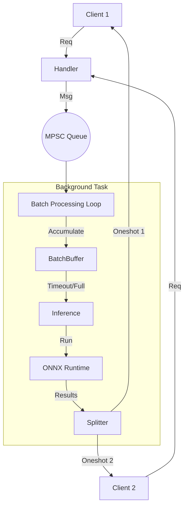

# Phase 3: Request Batching System

## 1. Phase Introduction

In production, processing requests one-by-one (even asynchronously) leaves performance on the table. CPUs and especially GPUs thrive on parallel data processing (SIMD).

**Dynamic Batching** allows us to:

1.  Collect incoming requests into a queue.
2.  Wait for a short window (e.g., 5ms) or until a batch fills up (e.g., 32 items).
3.  Stack inputs into a single large tensor (e.g., `[32, 3, 224, 224]`).
4.  Run inference once.
5.  Split results and return them to individual clients.

**Key Rust Concepts Introduced:**

- **Channels (`mpsc`, `oneshot`)**: Message passing between async tasks.
- **`tokio::spawn`**: Running background actors.
- **`tokio::select!`**: Waiting on multiple async conditions (time vs. data).
- **Concurrency Patterns**: The "Actor" pattern applied to ML serving.

### Architecture Flow



## 2. Prerequisites

No new external crates are strictly needed, but `tokio-stream` can sometimes be helpful. We will stick to standard `tokio` primitives.

## 3. Step-by-Step Implementation

### 3.1 Defining the Message Types

We need a way to send "work" to the batcher. A unit of work consists of the Input and a way to reply.

**File: `src/batching/mod.rs`**

```rust
pub mod queue;
```

**File: `src/batching/queue.rs`**

```rust
use tokio::sync::{mpsc, oneshot};
use tokio::time::{sleep, Duration};
use ndarray::{Array4, Axis, stack};
use std::sync::Arc;
use ort::Session;
use crate::error::InferenceError;

// Type alias for our Output (same as before)
type InferenceOutput = Vec<(usize, f32)>;

// The message sent from Handler -> Batcher
pub struct InferenceJob {
    pub input: Array4<f32>,
    pub result_sender: oneshot::Sender<Result<InferenceOutput, InferenceError>>,
}

// Configuration for the batcher
pub struct BatcherConfig {
    pub max_batch_size: usize,
    pub max_wait_ms: u64,
}

pub struct Batcher {
    receiver: mpsc::Receiver<InferenceJob>,
    session: Arc<Session>,
    config: BatcherConfig,
}

impl Batcher {
    pub fn new(
        receiver: mpsc::Receiver<InferenceJob>,
        session: Arc<Session>,
        config: BatcherConfig,
    ) -> Self {
        Self { receiver, session, config }
    }

    /// The main loop running in a background task
    pub async fn run(mut self) {
        let mut batch_buffer: Vec<InferenceJob> = Vec::with_capacity(self.config.max_batch_size);

        loop {
            // Wait for data or timeout
            let job = if batch_buffer.is_empty() {
                // If empty, simple await (no timeout needed yet)
                match self.receiver.recv().await {
                    Some(job) => job,
                    None => break, // Channel closed, shutdown
                }
            } else {
                // If we have items, wait for more OR timeout
                let timeout_duration = Duration::from_millis(self.config.max_wait_ms);

                tokio::select! {
                    msg = self.receiver.recv() => {
                        match msg {
                            Some(job) => job,
                            None => break,
                        }
                    }
                    _ = sleep(timeout_duration) => {
                        // Timeout reached, process current batch
                        self.process_batch(&mut batch_buffer).await;
                        continue;
                    }
                }
            };

            batch_buffer.push(job);

            if batch_buffer.len() >= self.config.max_batch_size {
                self.process_batch(&mut batch_buffer).await;
            }
        }
    }

    /// Run inference on the accumulated batch
    async fn process_batch(&self, jobs: &mut Vec<InferenceJob>) {
        if jobs.is_empty() { return; }

        // 1. Drain jobs from buffer to take ownership
        let current_jobs: Vec<InferenceJob> = jobs.drain(..).collect();

        // 2. Prepare Inputs
        // Extract all input tensors. They are [1, 3, 224, 224]
        // We use view() to get references for stacking
        let input_views: Vec<_> = current_jobs.iter()
            .map(|job| job.input.view())
            .collect();

        // Stack along batch axis (0) -> [N, 3, 224, 224]
        // Note: stack expects ViewRepr, might be tricky with generic constraints.
        // Easier way: usage of ndarray::concatenate
        let batch_input = match ndarray::concatenate(Axis(0), &input_views) {
            Ok(t) => t,
            Err(e) => {
                // Fatal error in tensor logic, reply errors to all
                for job in current_jobs {
                    let _ = job.result_sender.send(Err(InferenceError::PreprocessingError(e.to_string())));
                }
                return;
            }
        };

        // 3. Run Inference
        let result = (|| -> Result<Vec<Vec<(usize, f32)>>, InferenceError> {
             let input_name = &self.session.inputs[0].name;
             let outputs = self.session.run(ort::inputs![input_name => batch_input]?)?;

             let output_tensor = outputs[0].try_extract_tensor::<f32>()?;

             // Output is [N, 1000]
             let mut results = Vec::new();
             for r in 0..output_tensor.shape()[0] {
                 let row = output_tensor.index_axis(Axis(0), r);
                 let mut preds: Vec<(usize, f32)> = row.iter()
                     .enumerate()
                     .map(|(i, &p)| (i, p))
                     .collect();

                 // Sort by confidence descending
                 preds.sort_by(|a, b| b.1.partial_cmp(&a.1).unwrap_or(std::cmp::Ordering::Equal));

                 // Keep top 5
                 results.push(preds.into_iter().take(5).collect());
             }
             Ok(results)
        })();

        // 4. Distribute Results
        match result {
            Ok(mut all_preds) => {
                for (job, preds) in current_jobs.into_iter().zip(all_preds.into_iter()) {
                   // Only send if receiver is alive
                   let _ = job.result_sender.send(Ok(preds));
                }
            }
            Err(e) => {
                // Broadcast error
                let err_str = e.to_string(); // approximations
                for job in current_jobs {
                    let _ = job.result_sender.send(Err(InferenceError::PreprocessingError(err_str.clone())));
                    // (Real impl needs Clone on InferenceError or similar)
                }
            }
        }
    }
}
```

### 3.2 Updating App State & Handlers

The Handler no longer holds the `Session`. It holds the `Sender<InferenceJob>`.

**File: `src/server/types.rs`**

```rust
use tokio::sync::mpsc;
use crate::batching::queue::InferenceJob;

#[derive(Clone)]
pub struct AppState {
    pub inference_queue: mpsc::Sender<InferenceJob>,
}
```

**File: `src/server/handlers.rs`**

```rust
use tokio::sync::oneshot;

// ... Inside predict handler ...
pub async fn predict(
    State(state): State<Arc<AppState>>,
    Json(payload): Json<PredictRequest>,
) -> Result<Json<PredictResponse>, InferenceError> {
    // 1. Decode Base64
    let image_bytes = base64::engine::general_purpose::STANDARD
        .decode(&payload.image)
        .map_err(|e| InferenceError::PreprocessingError(format!("Base64 decode failed: {}", e)))?;

    // 2. Preprocess
    // Assuming process_image_buffer is available from previous phase refactor
    let start = std::time::Instant::now();
    let input_tensor = crate::preprocessing::image::process_image_buffer(&image_bytes)?;

    // 3. Create return channel
    let (tx, rx) = oneshot::channel();

    let job = InferenceJob {
        input: input_tensor,
        result_sender: tx,
    };

    // 4. Send to queue
    state.inference_queue.send(job).await
        .map_err(|_| InferenceError::PreprocessingError("Inference queue closed".into()))?;

    // 5. Await result
    let preds = rx.await
        .map_err(|_| InferenceError::PreprocessingError("Inference dropped".into()))??;

    let duration = start.elapsed();

    // 6. Format Response
    let predictions = preds.iter()
        .map(|(id, prob)| Prediction { class_id: *id, confidence: *prob })
        .collect();

    Ok(Json(PredictResponse {
        predictions,
        inference_time_ms: duration.as_secs_f64() * 1000.0,
    }))
}
```

### 3.3 Wiring it up in `main`

We spawn the batcher before starting the web server.

**File: `src/main.rs`**

```rust
use tokio::sync::mpsc;
use ml_inference_engine::batching::queue::{Batcher, BatcherConfig};

#[tokio::main]
async fn main() -> anyhow::Result<()> {
    // ... Load Session ...
    let session = Arc::new(model::loader::load_model("models/mobilenet.onnx")?);

    // Create Channel
    let (tx, rx) = mpsc::channel(100); // Backpressure buffer

    // Spawn Batcher
    let batcher = Batcher::new(rx, session, BatcherConfig {
        max_batch_size: 16,
        max_wait_ms: 5,
    });

    tokio::spawn(async move {
        batcher.run().await;
    });

    // Create Router with Sender
    let state = Arc::new(AppState { inference_queue: tx });
    let app = server::routes::create_router_with_state(state);

    // Serve
    // ...
}
```

## 4. Testing & Verification

### 4.1 Benchmarking Batching

To see the benefit, we need concurrent load. A tool like `k6` or `wrk` is usually best, but we can write a Rust load test.

**Concept**:
Sending 1 request takes ~30ms.
Sending 10 serial requests takes ~300ms.
Sending 10 concurrent requests with batching might take ~40ms (Batch overhead + inference time for larger batch is sub-linear).

**File: `tests/load_tests.rs`**

```rust
#[tokio::test]
async fn test_batching_concurrency() {
    // 1. Setup Environment
    model::loader::init_ort().unwrap();
    let session = Arc::new(model::loader::load_model("models/mobilenetv2-7.onnx").unwrap());

    let (tx, rx) = tokio::sync::mpsc::channel(100);

    // 2. Spawn Batcher
    let batcher = ml_inference_engine::batching::queue::Batcher::new(
        rx,
        session,
        ml_inference_engine::batching::queue::BatcherConfig {
            max_batch_size: 16,
            max_wait_ms: 10
        }
    );
    tokio::spawn(async move { batcher.run().await });

    // 3. Simulate Concurrent Requests
    let mut handles = vec![];
    let start_time = std::time::Instant::now();
    let num_requests = 50;

    for _ in 0..num_requests {
        let tx = tx.clone();
        handles.push(tokio::spawn(async move {
            // Create a fake input tensor (zeros)
            let input = ndarray::Array4::<f32>::zeros((1, 3, 224, 224));
            let (resp_tx, resp_rx) = tokio::sync::oneshot::channel();

            let job = ml_inference_engine::batching::queue::InferenceJob {
                input,
                result_sender: resp_tx,
            };

            tx.send(job).await.unwrap();
            let res = resp_rx.await.unwrap();
            assert!(res.is_ok());
        }));
    }

    // 4. Wait for all
    for h in handles {
        h.await.unwrap();
    }

    let duration = start_time.elapsed();
    println!("Processed {} requests in {:?}", num_requests, duration);

    // Basic verification: If 50 sequential requests take 50 * 30ms = 1.5s,
    // batched should take significantly less (e.g. 200ms).
    // assert!(duration.as_millis() < 1000);
}
```

## 5. Next Steps

We have a high-performance, batched inference server. But currently, we are hardcoded to "MobileNet".
In **Phase 4**, we will build a **Multi-Model Registry** to support hosting multiple models (e.g., specific models for specific users or tasks) and selecting them via URL parameters.
