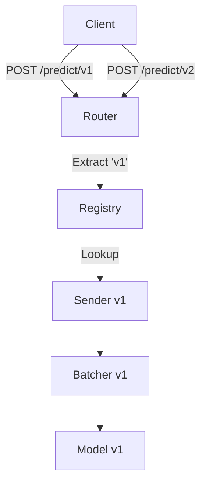

# Phase 4: Multi-Model Support & Versioning

## 1. Phase Introduction

Production systems rarely serve just one model. You might have `mobilenet-v2` for fast requests, `resnet-50` for high accuracy, and `mobilenet-v3` as an A/B test candidate.

In this phase, we evolve our single-model server into a **Multi-Model Inference Platform**.

**Goals:**

1.  Load multiple models at startup based on configuration.
2.  Route requests to specific models via URL (e.g., `/predict/mobilenet-v2`).
3.  Maintain independent batching queues for each model.
4.  Allow hot-reloading (conceptually) via the Registry pattern.

**Key Rust Concepts Introduced:**

- **`HashMap`**: Storing models by name.
- **`RwLock`**: Read-Write locks for data that is rarely changed but often read (the registry).
- **Path Extractors**: Getting variables from the URL in Axum.
- **Dynamic Dispatch**: Handling potential differences in models (optional, here we assume uniform interfaces).

### Architecture Flow



## 2. Prerequisites

- Download a second model for testing (e.g., `mobilenetv2-10.onnx` or just copy the existing one to a new name).

## 3. Step-by-Step Implementation

### 3.1 Model Configuration

Instead of hardcoding paths, we define a config structure.

**File: `src/config.rs`**

```rust
use serde::Deserialize;

#[derive(Deserialize, Clone)]
pub struct AppConfig {
    pub server: ServerConfig,
    pub models: Vec<ModelConfig>,
}

#[derive(Deserialize, Clone)]
pub struct ServerConfig {
    pub port: u16,
    pub host: String,
}

#[derive(Deserialize, Clone)]
pub struct ModelConfig {
    pub name: String,
    pub path: String,
    pub batch_size: usize,
    pub batch_timeout_ms: u64,
}
```

### 3.2 The Model Registry

We need a central place to hold the `Sender` for each running model batcher.

**File: `src/model/registry.rs`**

```rust
use std::collections::HashMap;
use std::sync::{Arc, RwLock};
use tokio::sync::mpsc;
use crate::batching::queue::InferenceJob;

/// The Registry maps a model name to its batcher queue.
/// We use RwLock to allow concurrent reads (lookups).
#[derive(Clone)]
pub struct ModelRegistry {
    // key: model_name, value: Sender to that model's batcher
    queues: Arc<RwLock<HashMap<String, mpsc::Sender<InferenceJob>>>>,
}

impl ModelRegistry {
    pub fn new() -> Self {
        Self {
            queues: Arc::new(RwLock::new(HashMap::new())),
        }
    }

    pub fn register(&self, name: String, sender: mpsc::Sender<InferenceJob>) {
        let mut map = self.queues.write().unwrap();
        map.insert(name, sender);
    }

    pub fn get(&self, name: &str) -> Option<mpsc::Sender<InferenceJob>> {
        let map = self.queues.read().unwrap();
        map.get(name).cloned()
    }
}

#[cfg(test)]
mod tests {
    use super::*;
    use ndarray::Array4;

    #[test]
    fn test_registry_creation() {
        let registry = ModelRegistry::new();
        assert!(registry.queues.read().unwrap().is_empty());
    }

    #[test]
    fn test_registry_register_and_get() {
        let registry = ModelRegistry::new();
        
        // Create a channel for testing
        let (tx, _rx) = mpsc::channel(10);
        
        // Register a model
        registry.register("model1".to_string(), tx);
        
        // Verify the model was registered
        assert!(registry.get("model1").is_some());
        assert!(registry.get("nonexistent").is_none());
    }

    #[test]
    fn test_registry_multiple_models() {
        let registry = ModelRegistry::new();
        
        // Create multiple channels
        let (tx1, _rx1) = mpsc::channel(10);
        let (tx2, _rx2) = mpsc::channel(10);
        
        // Register multiple models
        registry.register("model1".to_string(), tx1);
        registry.register("model2".to_string(), tx2);
        
        // Verify both models are registered
        assert!(registry.get("model1").is_some());
        assert!(registry.get("model2").is_some());
        assert!(registry.get("nonexistent").is_none());
    }

    #[test]
    fn test_registry_overwrite() {
        let registry = ModelRegistry::new();
        
        // Create channels
        let (tx1, _rx1) = mpsc::channel(10);
        let (tx2, _rx2) = mpsc::channel(10);
        
        // Register first model
        registry.register("model1".to_string(), tx1);
        assert!(registry.get("model1").is_some());
        
        // Overwrite with new model
        registry.register("model1".to_string(), tx2);
        assert!(registry.get("model1").is_some());
    }

    #[test]
    fn test_registry_concurrent_access() {
        let registry = ModelRegistry::new();
        
        // Register a model
        let (tx, _rx) = mpsc::channel(10);
        registry.register("test_model".to_string(), tx);
        
        // Test concurrent read access
        let registry_clone = registry.clone();
        let handle = std::thread::spawn(move || {
            for i in 0..100 {
                let _sender = registry_clone.get(&format!("test_model"));
            }
        });
        
        // Do some other operations in main thread
        for i in 0..50 {
            let _sender = registry.get("test_model");
        }
        
        handle.join().unwrap();
    }

    #[test]
    fn test_registry_clone() {
        let registry1 = ModelRegistry::new();
        let (tx, _rx) = mpsc::channel(10);
        registry1.register("model1".to_string(), tx);
        
        // Clone the registry
        let registry2 = registry1.clone();
        
        // Both should have access to the same model
        assert!(registry1.get("model1").is_some());
        assert!(registry2.get("model1").is_some());
    }

    #[tokio::test]
    async fn test_registry_with_real_job() {
        let registry = ModelRegistry::new();
        
        // Create a channel and send a real job through it
        let (tx, mut rx) = mpsc::channel(10);
        registry.register("test_model".to_string(), tx);
        
        // Create a dummy tensor and sender for the job
        let dummy_tensor = Array4::<f32>::zeros((1, 3, 224, 224));
        let (result_tx, result_rx) = tokio::sync::oneshot::channel();
        
        let job = InferenceJob {
            input: dummy_tensor,
            result_sender: result_tx,
        };
        
        // Get the sender from registry and send the job
        if let Some(sender) = registry.get("test_model") {
            let send_result = sender.send(job).await;
            assert!(send_result.is_ok());
        } else {
            panic!("Model not found in registry");
        }
        
        // The job should be received by the receiver
        let received_job = tokio::time::timeout(std::time::Duration::from_millis(100), rx.recv()).await;
        assert!(received_job.is_ok());
        assert!(received_job.unwrap().is_some());
    }
}
```

### 3.3 Updating Handlers

The predict handler now takes `Path<String>` to identify the model.

**File: `src/server/handlers.rs`**

```rust
use axum::extract::Path;

pub async fn predict(
    State(state): State<Arc<AppState>>,
    Path(model_name): Path<String>, // url: /predict/:model_name
    Json(payload): Json<PredictRequest>,
) -> Result<Json<PredictResponse>, InferenceError> {

    // 1. Resolve Model
    let queue = state.registry.get(&model_name)
        .ok_or_else(|| InferenceError::ModelNotFound(model_name.clone()))?;

    // 2. Preprocess
    // We assume all models take the same image input for now.
    // In a real system, ModelConfig might define specific preprocessing params.
    let image_bytes = general_purpose::STANDARD
        .decode(&payload.image)
        .map_err(|e| InferenceError::PreprocessingError(e.to_string()))?;

    let input_tensor = crate::preprocessing::image::process_bytes(&image_bytes)?;

    // 3. Send to specific queue
    let (tx, rx) = oneshot::channel();
    let job = InferenceJob { input: input_tensor, result_sender: tx };

    queue.send(job).await
        .map_err(|_| InferenceError::PreprocessingError("Queue closed".into()))?;

    let preds = rx.await
        .map_err(|_| InferenceError::PreprocessingError("Inference dropped".into()))??;

    // 4. Return
    // ... (Response definitions) ...
    Ok(Json(PredictResponse {
        predictions: preds.into_iter().take(5).map(|(id,p)| Prediction{class_id:id, confidence:p}).collect(),
        inference_time_ms: 0.0, // We lost timing info in this refactor, can add it back to InferenceJob result
    }))
}
```

### 3.4 Updating App State & Routes

**File: `src/server/types.rs`**

```rust
use crate::model::registry::ModelRegistry;

#[derive(Clone)]
pub struct AppState {
    pub registry: ModelRegistry,
}
```

**File: `src/server/routes.rs`**

```rust
// ...
pub fn create_router(registry: ModelRegistry) -> Router {
    let state = Arc::new(AppState { registry });

    Router::new()
        .route("/health", get(handlers::health_check))
        .route("/predict/:model_name", post(handlers::predict)) // Dynamic path
        .with_state(state)
}
```

### 3.5 Main Bootstrapping

Iterate over config, load models, spawn batchers.

**File: `config.yaml`** (Example)

```yaml
server:
  port: 3000
  host: "0.0.0.0"

models:
  - name: "mobilenet_v2"
    path: "models/mobilenetv2-7.onnx"
    batch_size: 16
    batch_timeout_ms: 5
  - name: "mobilenet_backup"
    path: "models/mobilenetv2-7.onnx"
    batch_size: 8
    batch_timeout_ms: 10
```

**File: `src/main.rs`**

```rust
use std::fs;
use cronnx::{config::AppConfig, model, batching};

#[tokio::main]
async fn main() -> anyhow::Result<()> {
    model::loader::init_ort()?;

    // 1. Load Config
    let config_content = fs::read_to_string("config.yaml")?;
    let config: AppConfig = serde_yaml::from_str(&config_content)?;

    let registry = model::registry::ModelRegistry::new();

    // 2. Initialize Models
    for model_conf in config.models {
        println!("Loading model: {}", model_conf.name);
        let session = model::loader::load_model(&model_conf.path)?;
        let session = std::sync::Arc::new(session);

        let (tx, rx) = tokio::sync::mpsc::channel(100);

        let batcher = batching::queue::Batcher::new(
            rx,
            session,
            batching::queue::BatcherConfig {
                max_batch_size: model_conf.batch_size,
                max_wait_ms: model_conf.batch_timeout_ms,
            }
        );

        tokio::spawn(async move { batcher.run().await });

        registry.register(model_conf.name, tx);
    }

    // 3. Serve
    let app = cronnx::server::routes::create_router(registry);
    let listener = tokio::net::TcpListener::bind(format!("{}:{}", config.server.host, config.server.port)).await?;
    axum::serve(listener, app).await?;

    Ok(())
}
```

## 4. Testing & Verification

### 4.1 Test Requests

```bash
# Call model 1
curl -X POST http://localhost:3000/predict/mobilenet_v2 ...

# Call model 2
curl -X POST http://localhost:3000/predict/mobilenet_backup ...

# Call invalid model
curl -X POST http://localhost:3000/predict/gpt-4 ...
# Expected: 500 Internal Error (ModelNotFound) -> Should map to 404 in a refined implementation
```

## 5. Troubleshooting

- **Borrow Checker with Map**: `registry.queues.read().unwrap()` returns a guard. You cannot return a reference to the map inside. That's why we use `cloned()` on the Sender (Senders are cheap to clone) to return an owned value.
- **Config Parsing**: Ensure `serde` features `derive` is enabled and `serde_yaml` is added to Cargo.toml.

## 6. Next Steps

We have a robust multi-model server. But how is it performing? Are queues filling up? Is one model slower than another?
In **Phase 5**, we will add **Observability** (Metrics & Tracing) to answer these questions using Prometheus and Grafana.