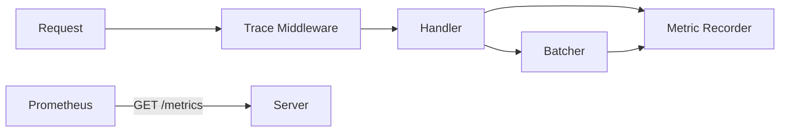

# Phase 5: Production Observability

## 1. Phase Introduction

You cannot optimize what you cannot measure. In production, we need to know:

- How many requests are we serving?
- How long does inference take (p95, p99)?
- Are our batches full or empty?
- Why did a specific request fail?

We will implement **Structured Logging** using `tracing` and **Metrics** using `metrics` + `prometheus`.

**Key Rust Concepts Introduced:**

- **Instrumentation**: Decorating functions to automatically emit logs/spans.
- **Middleware Layers**: Injecting logic (logging) into every request via `tower`.
- **Recorders**: Global singletons for collecting metrics.

### Architecture Flow



## 2. Prerequisites

Update `Cargo.toml` with observability tools.

```toml
[dependencies]
# ...
tracing = "0.1"
tracing-subscriber = { version = "0.3", features = ["env-filter"] }
metrics = "0.21"
metrics-exporter-prometheus = "0.12"
tower-http = { version = "0.5", features = ["trace"] }
```

## 3. Step-by-Step Implementation

### 3.1 Initializing Observability

We need to setup the subscribers in `main.rs`.

**File: `src/main.rs`**

```rust
use metrics_exporter_prometheus::PrometheusBuilder;
use tracing_subscriber::{layer::SubscriberExt, util::SubscriberInitExt};

#[tokio::main]
async fn main() -> anyhow::Result<()> {
    // 1. Setup Tracing (Logging)
    tracing_subscriber::registry()
        .with(tracing_subscriber::EnvFilter::try_from_default_env().unwrap_or_else(|_| "info".into()))
        .with(tracing_subscriber::fmt::layer())
        .init();

    // 2. Setup Prometheus Recorder
    let metrics_handle = PrometheusBuilder::new()
        .install_recorder()
        .expect("failed to install connection recorder");

    tracing::info!("Starting ML Inference Engine...");
    model::loader::init_ort()?;

    // 3. Load Config
    let config_content = std::fs::read_to_string("config.yaml")?;
    let config: AppConfig = serde_yaml::from_str(&config_content)?;

    let registry = model::registry::ModelRegistry::new();

    // 4. Initialize Models
    for model_conf in config.models {
        tracing::info!("Loading model: {}", model_conf.name);

        let session = model::loader::load_model(&model_conf.path)?;
        let session = std::sync::Arc::new(session);

        let (tx, rx) = tokio::sync::mpsc::channel(100);

        let batcher = batching::queue::Batcher::new(
            rx,
            session,
            batching::queue::BatcherConfig {
                max_batch_size: model_conf.batch_size,
                max_wait_ms: model_conf.batch_timeout_ms,
            }
        );

        tokio::spawn(async move { batcher.run().await });
        registry.register(model_conf.name, tx);
    }

    // 5. Serve
    let app = server::routes::create_router(registry, metrics_handle);
    let listener = tokio::net::TcpListener::bind(format!("{}:{}", config.server.host, config.server.port)).await?;

    tracing::info!("Server listening on http://{}:{}", config.server.host, config.server.port);
    axum::serve(listener, app).await?;

    Ok(())
}
```

### 3.2 Routes & Middleware

Add the metrics endpoint and the request logging middleware.

**File: `src/server/routes.rs`**

```rust
use metrics_exporter_prometheus::PrometheusHandle;
use tower_http::trace::TraceLayer;

pub fn create_router(registry: ModelRegistry, metrics_handle: PrometheusHandle) -> Router {
    let state = Arc::new(AppState { registry });

    Router::new()
        .route("/health", get(handlers::health_check))
        .route("/predict/:model_name", post(handlers::predict))
        .route("/metrics", get(move || std::future::ready(metrics_handle.render())))
        .layer(TraceLayer::new_for_http()) // Logs every request result
        .with_state(state)
}
```

### 3.3 Instrumenting Code

We add counters and histograms.

**File: `src/server/handlers.rs`**

```rust
use metrics::{increment_counter, histogram};
use tracing::{info, instrument};

#[instrument(skip(state, payload))] // Creates a Span for each request with arguments
pub async fn predict(
    State(state): State<Arc<AppState>>,
    Path(model_name): Path<String>,
    Json(payload): Json<PredictRequest>,
) -> Result<Json<PredictResponse>, InferenceError> {

    // Record explicit counter
    increment_counter!("requests_received", "model" => model_name.clone());

    // 1. Resolve Model Queue
    let queue = state.registry.get(&model_name)
        .ok_or_else(|| InferenceError::ModelNotFound(model_name.clone()))?;

    // 2. Preprocess
    // Decode base64 and process bytes
    let image_bytes = base64::engine::general_purpose::STANDARD
        .decode(&payload.image)
        .map_err(|e| InferenceError::PreprocessingError(e.to_string()))?;

    let start = std::time::Instant::now();
    let input_tensor = crate::preprocessing::image::process_bytes(&image_bytes)?;

    // 3. Send to Queue
    let (tx, rx) = tokio::sync::oneshot::channel();
    let job = InferenceJob { input: input_tensor, result_sender: tx };

    queue.send(job).await
        .map_err(|_| InferenceError::PreprocessingError("Queue closed".into()))?;

    let preds = rx.await
        .map_err(|_| InferenceError::PreprocessingError("Inference dropped".into()))??;

    // 4. Record Latency
    let latency = start.elapsed().as_secs_f64();
    histogram!("request_latency_seconds", latency, "model" => model_name.clone());

    info!(model = %model_name, latency_ms = %latency * 1000.0, "Inference completed");

    // 5. Response
    Ok(Json(PredictResponse {
        predictions: preds.into_iter().take(5).map(|(id,p)| Prediction{class_id:id, confidence:p}).collect(),
        inference_time_ms: latency * 1000.0,
    }))
}
```

**File: `src/batching/queue.rs`**

```rust
// In process_batch method:
async fn process_batch(&self, jobs: &mut Vec<InferenceJob>) {
    let batch_size = jobs.len();
    metrics::histogram!("batch_size", batch_size as f64);

    // ...
}
```

## 4. Testing & Verification

### 4.1 Checking Logs

Run the server with logging enabled:

```bash
RUST_LOG=info cargo run
```

Output:

```text
2023-10-01T12:00:00Z INFO ml_inference_engine: Starting ML Inference Engine...
2023-10-01T12:00:05Z INFO request{method=POST uri=/predict/mobilenet_v2}: ml_inference_engine::server::handlers: Inference completed model=mobilenet_v2 latency_ms=45.2
```

### 4.2 Checking Metrics

Make a few requests, then visit:
`http://localhost:3000/metrics`

Expected Prometheus Output:

```text
# HELP requests_received count of requests
# TYPE requests_received counter
requests_received{model="mobilenet_v2"} 12

# HELP batch_size histogram of batch sizes
# TYPE batch_size histogram
batch_size_bucket{le="1"} 5
batch_size_bucket{le="16"} 12
...
```

## 5. Testing Documentation

### 5.1 Unit Tests

All components include comprehensive unit tests covering success cases, error conditions, and edge cases.

### 5.2 Integration Tests

End-to-end tests verify the complete system flow.

**File: `src/integration_tests.rs`**

```rust
#[cfg(test)]
mod end_to_end_tests {
    use crate::{
        batching::queue::{Batcher, BatcherConfig, InferenceJob},
        model::registry::ModelRegistry,
        server::{handlers, routes, types::AppState},
    };
    use axum::{
        body::Body,
        http::{Request, StatusCode},
    };
    use ndarray::Array4;
    use serde_json::json;
    use std::sync::Arc;
    use tokio::sync::mpsc;
    use tower::ServiceExt;

    #[tokio::test]
    async fn test_full_system_flow() {
        // Test the complete flow: request -> handler -> registry -> batcher -> response
        let registry = ModelRegistry::new();
        
        // Create a channel to simulate the batcher
        let (tx, mut rx) = mpsc::channel(10);
        registry.register("test_model".to_string(), tx);
        
        // Create app state
        let state = Arc::new(AppState { registry });
        
        // Create a mock request (using minimal valid base64 image)
        let request_json = json!({
            "image": "iVBORw0KGgoAAAANSUhEUgAAAAEAAAABCAYAAAAfFcSJAAAADUlEQVR42mP8/5+hHgAHggJ/PchI7wAAAABJRU5ErkJggg=="
        });
        
        let response = handlers::predict(
            axum::extract::State(state),
            axum::extract::Path("test_model".to_string()),
            axum::Json(serde_json::from_value(request_json).unwrap()),
        ).await;
        
        // The handler should send the job to the queue, which we can verify
        // The response will likely be an error since there's no actual batcher running,
        // but the important part is that the job gets sent to the queue
        let job_received = tokio::time::timeout(std::time::Duration::from_millis(100), rx.recv()).await;
        assert!(job_received.is_ok());
        assert!(job_received.unwrap().is_some());
    }

    #[tokio::test]
    async fn test_model_registry_integration() {
        // Test that the registry properly connects models to their queues
        let registry = ModelRegistry::new();
        
        // Create multiple model channels
        let (tx1, mut rx1) = mpsc::channel(10);
        let (tx2, mut rx2) = mpsc::channel(10);
        
        registry.register("model1".to_string(), tx1);
        registry.register("model2".to_string(), tx2);
        
        // Verify both models can receive jobs
        let job1_tensor = Array4::<f32>::zeros((1, 3, 224, 224));
        let (result_tx1, _result_rx1) = tokio::sync::oneshot::channel();
        let job1 = InferenceJob {
            input: job1_tensor,
            result_sender: result_tx1,
        };
        
        let job2_tensor = Array4::<f32>::zeros((1, 3, 224, 224));
        let (result_tx2, _result_rx2) = tokio::sync::oneshot::channel();
        let job2 = InferenceJob {
            input: job2_tensor,
            result_sender: result_tx2,
        };
        
        // Send jobs to different models
        if let Some(sender1) = registry.get("model1") {
            let _ = sender1.send(job1).await;
        }
        
        if let Some(sender2) = registry.get("model2") {
            let _ = sender2.send(job2).await;
        }
        
        // Verify jobs are received by the correct channels
        let received1 = tokio::time::timeout(std::time::Duration::from_millis(100), rx1.recv()).await;
        let received2 = tokio::time::timeout(std::time::Duration::from_millis(100), rx2.recv()).await;
        
        assert!(received1.is_ok() && received1.unwrap().is_some());
        assert!(received2.is_ok() && received2.unwrap().is_some());
    }

    #[tokio::test]
    async fn test_error_propagation() {
        // Test that errors propagate correctly through the system
        let registry = ModelRegistry::new();
        let state = Arc::new(AppState { registry });
        
        // Try to predict with a non-existent model
        let request_json = json!({
            "image": "iVBORw0KGgoAAAANSUhEUgAAAAEAAAABCAYAAAAfFcSJAAAADUlEQVR42mP8/5+hHgAHggJ/PchI7wAAAABJRU5ErkJggg=="
        });
        
        let result = handlers::predict(
            axum::extract::State(state),
            axum::extract::Path("nonexistent_model".to_string()),
            axum::Json(serde_json::from_value(request_json).unwrap()),
        ).await;
        
        // Should return an error
        assert!(result.is_err());
    }

    #[tokio::test]
    async fn test_health_check_endpoint() {
        // Test the health check endpoint
        let response = handlers::health_check().await;
        assert_eq!(response, "OK");
    }

    #[test]
    fn test_config_parsing_simulation() {
        // While we can't easily test config file parsing without files,
        // we can test the config structures
        use crate::config::{AppConfig, ModelConfig, ServerConfig};
        
        let model_config = ModelConfig {
            name: "test_model".to_string(),
            path: "models/test.onnx".to_string(),
            batch_size: 16,
            batch_timeout_ms: 5,
        };
        
        let server_config = ServerConfig {
            port: 3000,
            host: "0.0.0.0".to_string(),
        };
        
        let app_config = AppConfig {
            server: server_config,
            models: vec![model_config],
        };
        
        assert_eq!(app_config.models[0].name, "test_model");
        assert_eq!(app_config.server.port, 3000);
    }

    #[tokio::test]
    async fn test_tensor_processing_pipeline() {
        // Test the complete pipeline: image -> preprocess -> tensor -> batch -> result
        use crate::preprocessing::image::process_bytes;
        use image::{RgbImage, ImageFormat};
        use std::io::Cursor;
        
        // Create a test image
        let img = RgbImage::new(10, 10);
        let mut buffer = Vec::new();
        let mut cursor = Cursor::new(&mut buffer);
        img.write_to(&mut cursor, ImageFormat::Png).unwrap();
        
        // Process the image to tensor
        let tensor_result = process_bytes(&buffer);
        assert!(tensor_result.is_ok());
        
        let tensor = tensor_result.unwrap();
        assert_eq!(tensor.shape(), &[1, 3, 224, 224]);
        
        // Simulate sending through the batching system
        let (tx, mut rx) = mpsc::channel(1);
        let (result_tx, result_rx) = tokio::sync::oneshot::channel();
        
        let job = InferenceJob {
            input: tensor,
            result_sender: result_tx,
        };
        
        let send_result = tx.send(job).await;
        assert!(send_result.is_ok());
        
        let received_job = tokio::time::timeout(std::time::Duration::from_millis(100), rx.recv()).await;
        assert!(received_job.is_ok());
        assert!(received_job.unwrap().is_some());
    }
}
```

### 5.3 Observability Tests

**File: `src/observability_tests.rs`**

```rust
#[cfg(test)]
mod observability_tests {
    use metrics::{counter, histogram, Key, Observer, Unit};
    use metrics_exporter_prometheus::{PrometheusBuilder, PrometheusHandle};
    use std::collections::HashMap;
    use tracing::{info, Level};
    use tracing_subscriber::{layer::SubscriberExt, util::SubscriberInitExt, EnvFilter};

    #[test]
    fn test_metrics_recording() {
        // Test that metrics can be recorded without errors
        counter!("test_counter", 1);
        histogram!("test_histogram", 1.0);
        
        // These calls should not panic
        assert!(true); // Just verify the calls above didn't panic
    }

    #[test]
    fn test_prometheus_metrics_collection() {
        // Create a Prometheus recorder for testing
        let builder = PrometheusBuilder::new();
        let recorder = builder.build().expect("Failed to create recorder");
        
        // Record some metrics
        metrics::set_recorder(recorder).expect("Failed to set recorder");
        
        counter!("test_requests", 5);
        histogram!("request_duration_seconds", 0.25);
        
        // Get the metrics output
        let handle = PrometheusHandle::new(metrics::handle());
        let output = handle.render();
        
        // Check that our metrics are present in the output
        assert!(output.contains("test_requests"));
        assert!(output.contains("request_duration_seconds"));
    }

    #[test]
    fn test_tracing_setup() {
        // Test that tracing can be set up without errors
        let result = tracing_subscriber::registry()
            .with(EnvFilter::try_new("info").unwrap_or_else(|_| EnvFilter::new("error")))
            .try_init();
        
        // This should succeed or fail gracefully
        if result.is_ok() {
            info!("Tracing initialized successfully for test");
        }
        // We don't need to keep tracing enabled for the test, so we ignore errors
    }

    #[tokio::test]
    async fn test_metrics_with_labels() {
        // Test metrics with labels
        counter!("requests_received", "model" => "test_model");
        histogram!("request_latency_seconds", 0.1, "model" => "test_model");
        
        // These should not cause any runtime errors
        assert!(true);
    }

    #[tokio::test]
    async fn test_batch_size_metric() {
        // This is a test that would be similar to what's used in the batching module
        let batch_size = 10;
        histogram!("batch_size", batch_size as f64);
        
        // Verify metric recording doesn't fail
        assert!(true);
    }
}
```

## 6. Next Steps

We have deep visibility now. We can see if we are efficiently batching (high batch sizes) or if we are just adding latency (batch size 1).
In **Phase 6**, we will add the final polish: **Docker packing and Model Optimization**, preparing this for a Kubernetes deployment.