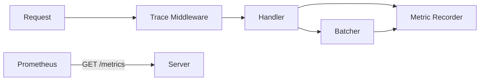

# Phase 5: Production Observability

## 1. Phase Introduction

You cannot optimize what you cannot measure. In production, we need to know:

- How many requests are we serving?
- How long does inference take (p95, p99)?
- Are our batches full or empty?
- Why did a specific request fail?

We will implement **Structured Logging** using `tracing` and **Metrics** using `metrics` + `prometheus`.

**Key Rust Concepts Introduced:**

- **Instrumentation**: Decorating functions to automatically emit logs/spans.
- **Middleware Layers**: Injecting logic (logging) into every request via `tower`.
- **Recorders**: Global singletons for collecting metrics.

### Architecture Flow



## 2. Prerequisites

Update `Cargo.toml` with observability tools.

```toml
[dependencies]
# ...
tracing = "0.1"
tracing-subscriber = { version = "0.3", features = ["env-filter"] }
metrics = "0.21"
metrics-exporter-prometheus = "0.12"
tower-http = { version = "0.5", features = ["trace"] }
```

## 3. Step-by-Step Implementation

### 3.1 Initializing Observability

We need to setup the subscribers in `main.rs`.

**File: `src/main.rs`**

```rust
use metrics_exporter_prometheus::PrometheusBuilder;
use tracing_subscriber::{layer::SubscriberExt, util::SubscriberInitExt};

#[tokio::main]
async fn main() -> anyhow::Result<()> {
    // 1. Setup Tracing (Logging)
    tracing_subscriber::registry()
        .with(tracing_subscriber::EnvFilter::try_from_default_env().unwrap_or_else(|_| "info".into()))
        .with(tracing_subscriber::fmt::layer())
        .init();

    // 2. Setup Prometheus Recorder
    let metrics_handle = PrometheusBuilder::new()
        .install_recorder()
        .expect("failed to install connection recorder");

    tracing::info!("Starting ML Inference Engine...");
    model::loader::init_ort()?;

    // 3. Load Config
    let config_content = std::fs::read_to_string("config.yaml")?;
    let config: AppConfig = serde_yaml::from_str(&config_content)?;

    let registry = model::registry::ModelRegistry::new();

    // 4. Initialize Models
    for model_conf in config.models {
        tracing::info!("Loading model: {}", model_conf.name);

        let session = model::loader::load_model(&model_conf.path)?;
        let session = std::sync::Arc::new(session);

        let (tx, rx) = tokio::sync::mpsc::channel(100);

        let batcher = batching::queue::Batcher::new(
            rx,
            session,
            batching::queue::BatcherConfig {
                max_batch_size: model_conf.batch_size,
                max_wait_ms: model_conf.batch_timeout_ms,
            }
        );

        tokio::spawn(async move { batcher.run().await });
        registry.register(model_conf.name, tx);
    }

    // 5. Serve
    let app = server::routes::create_router(registry, metrics_handle);
    let listener = tokio::net::TcpListener::bind(format!("{}:{}", config.server.host, config.server.port)).await?;

    tracing::info!("Server listening on http://{}:{}", config.server.host, config.server.port);
    axum::serve(listener, app).await?;

    Ok(())
}
```

### 3.2 Routes & Middleware

Add the metrics endpoint and the request logging middleware.

**File: `src/server/routes.rs`**

```rust
use metrics_exporter_prometheus::PrometheusHandle;
use tower_http::trace::TraceLayer;

pub fn create_router(registry: ModelRegistry, metrics_handle: PrometheusHandle) -> Router {
    let state = Arc::new(AppState { registry });

    Router::new()
        .route("/health", get(handlers::health_check))
        .route("/predict/:model_name", post(handlers::predict))
        .route("/metrics", get(move || std::future::ready(metrics_handle.render())))
        .layer(TraceLayer::new_for_http()) // Logs every request result
        .with_state(state)
}
```

### 3.3 Instrumenting Code

We add counters and histograms.

**File: `src/server/handlers.rs`**

```rust
use metrics::{increment_counter, histogram};
use tracing::{info, instrument};

#[instrument(skip(state, payload))] // Creates a Span for each request with arguments
pub async fn predict(
    State(state): State<Arc<AppState>>,
    Path(model_name): Path<String>,
    Json(payload): Json<PredictRequest>,
) -> Result<Json<PredictResponse>, InferenceError> {

    // Record explicit counter
    increment_counter!("requests_received", "model" => model_name.clone());

    // 1. Resolve Model Queue
    let queue = state.registry.get(&model_name)
        .ok_or_else(|| InferenceError::ModelNotFound(model_name.clone()))?;

    // 2. Preprocess
    // Decode base64 and process bytes
    let image_bytes = base64::engine::general_purpose::STANDARD
        .decode(&payload.image)
        .map_err(|e| InferenceError::PreprocessingError(e.to_string()))?;

    let start = std::time::Instant::now();
    let input_tensor = crate::preprocessing::image::process_image_buffer(&image_bytes)?;

    // 3. Send to Queue
    let (tx, rx) = tokio::sync::oneshot::channel();
    let job = InferenceJob { input: input_tensor, result_sender: tx };

    queue.send(job).await
        .map_err(|_| InferenceError::PreprocessingError("Queue closed".into()))?;

    let preds = rx.await
        .map_err(|_| InferenceError::PreprocessingError("Inference dropped".into()))??;

    // 4. Record Latency
    let latency = start.elapsed().as_secs_f64();
    histogram!("request_latency_seconds", latency, "model" => model_name.clone());

    info!(model = %model_name, latency_ms = %latency * 1000.0, "Inference completed");

    // 5. Response
    Ok(Json(PredictResponse {
        predictions: preds.into_iter().take(5).map(|(id,p)| Prediction{class_id:id, confidence:p}).collect(),
        inference_time_ms: latency * 1000.0,
    }))
}
```

**File: `src/batching/queue.rs`**

```rust
// In process_batch method:
async fn process_batch(&self, jobs: &mut Vec<InferenceJob>) {
    let batch_size = jobs.len();
    metrics::histogram!("batch_size", batch_size as f64);

    // ...
}
```

## 4. Testing & Verification

### 4.1 Checking Logs

Run the server with logging enabled:

```bash
RUST_LOG=info cargo run
```

Output:

```text
2023-10-01T12:00:00Z INFO ml_inference_engine: Starting ML Inference Engine...
2023-10-01T12:00:05Z INFO request{method=POST uri=/predict/mobilenet_v2}: ml_inference_engine::server::handlers: Inference completed model=mobilenet_v2 latency_ms=45.2
```

### 4.2 Checking Metrics

Make a few requests, then visit:
`http://localhost:3000/metrics`

Expected Prometheus Output:

```text
# HELP requests_received count of requests
# TYPE requests_received counter
requests_received{model="mobilenet_v2"} 12

# HELP batch_size histogram of batch sizes
# TYPE batch_size histogram
batch_size_bucket{le="1"} 5
batch_size_bucket{le="16"} 12
...
```

## 5. Next Steps

We have deep visibility now. We can see if we are efficiently batching (high batch sizes) or if we are just adding latency (batch size 1).
In **Phase 6**, we will add the final polish: **Docker packing and Model Optimization**, preparing this for a Kubernetes deployment.
